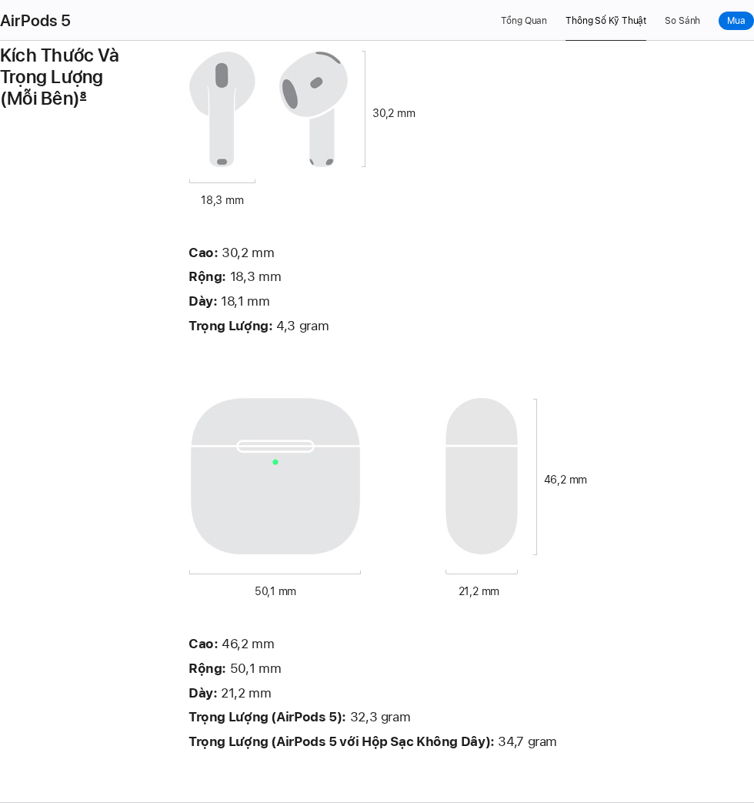

# Hồ sơ nguồn kiểm tra ngày 08/10/2026

Ảnh lấy từ trang thật bằng Chromium/Playwright, không thay nội dung trang. Thời điểm UTC, URL yêu cầu/URL cuối, trạng thái HTTP, SHA-256 và kích thước tệp nằm trong từng `metadata.json` và [capture-index.json](capture-index.json). Các ảnh `*-section.png` chụp bổ sung có thời điểm riêng ở trường `supplement`; chữ và ảnh giữ nguyên, chỉ chọn vùng trang. `full-page.png` giữ ngữ cảnh toàn trang, các ảnh mục bổ sung chờ tải xong hình lazy-load.

## Nguồn Apple

| Mẫu | Trang chính thức | Ảnh chính |
|---|---|---|
| EX-01–04 | [AirPods 5 VN](https://www.apple.com/vn/airpods-5/specs/) | [Tai nghe và hộp](apple-airpods5-vn/dimensions-section.png), [pin](apple-airpods5-vn/battery-section.png), [toàn trang](apple-airpods5-vn/full-page.png) |
| EX-05–08 | [AirPods Pro 3 VN](https://www.apple.com/vn/airpods-pro/specs/) | [Bluetooth](apple-pro3-vn/connectivity-section.png), [pin, gồm điều kiện 7,5 giờ](apple-pro3-vn/battery-section.png), [toàn trang](apple-pro3-vn/full-page.png) |
| EX-09–12 | [AirPods Max 2 VN](https://www.apple.com/vn/airpods-max/specs/) | [Pin](apple-max2-vn/battery-section.png), [toàn trang](apple-max2-vn/full-page.png) |
| EX-13–16 | [AirPods 4 Moldova](https://www.apple.com/md/airpods-4/specs/) | [Khối lượng](apple-airpods4-md/dimensions-section.png), [pin](apple-airpods4-md/battery-section.png), [toàn trang](apple-airpods4-md/full-page.png) |
| EX-17–20 | [AirPods 2 VN](https://support.apple.com/vi-vn/111856) | [Pin](apple-airpods2-vn/battery.png), [toàn trang và chú thích 3–4](apple-airpods2-vn/full-page.png) |



Mỗi thư mục có `response.html` (phản hồi gốc), `page.html` (DOM trình duyệt), `page.txt` (chữ hiển thị). Không coi ngày 08/10 là snapshot lịch sử 07/10 hoặc tháng 9. Trang có thể đổi sau lần chụp; ảnh đơn lẻ không chứng minh lịch sử trước thời điểm metadata.

## Hồ sơ mẫu và bài báo

- [examples.json](examples.json): câu cũ, câu rà soát, nguồn gốc, lý do sửa, đoạn nguyên văn/offset/dòng, điều kiện, ảnh và nhãn từng mẫu. 20 câu cũ **chưa rõ nguồn gốc**; ba ca `SIM-*` **giả lập**. Không ca nào được tự động tính là dữ liệu quảng cáo LLM thí nghiệm.
- `ref07-fever/` đến `ref11-vinumfcr/`: metadata/HTML/văn bản của cả năm tài liệu mới. Danh mục được đối chiếu trang xuất bản, không đoán năm/số trang.
- [papers/manifest.json](papers/manifest.json): trang PDF gốc và SHA-256, kèm ảnh bảng/mục chứa số liệu bị nghi ngờ. PDF đầy đủ đã có trong `báo/`, không nhân bản.
- [Bảng kết luận kiểm tra](../../docs/KIEM_TRA_PHAN_BIEN_2026-10-08.md): đúng/sai/chưa thể kết luận cho từng nhận xét.

## Kiểm tra lại từ workspace

```bash
python3 scripts/audit_examples.py --check
python3 scripts/check_paper_facts.py
python3 scripts/update_thesis_docs.py --check
```

Lệnh đầu kiểm đoạn trích đúng byte Unicode trong `page.txt`, tệp ảnh tồn tại và hash mọi tệp nguồn khớp metadata. Lệnh thứ hai cần Poppler `pdftotext`, kiểm vị trí trang và số liệu nhưng không thay việc đọc tiêu đề hàng/cột; `--record` tạo lại ảnh và manifest từ PDF gốc. Lệnh thứ ba kiểm nội dung và cấu trúc DOCX, không chạy mô hình nghiên cứu.

Script [capture_evidence.mjs](../../scripts/capture_evidence.mjs) cần Playwright/Chromium (không thêm dependency vào dự án). Có thể chỉ định đường dẫn module bằng `KLTN_PLAYWRIGHT_MODULE` và browser bằng `PLAYWRIGHT_BROWSERS_PATH`. Lần chụp mặc định bỏ qua hồ sơ đã có; `--supplement` chụp lại các mục ở thời điểm chạy và cập nhật metadata tương ứng. Muốn nghiên cứu thay đổi theo thời gian, tạo thư mục ngày mới trước, không ghi đè snapshot lịch sử này.
